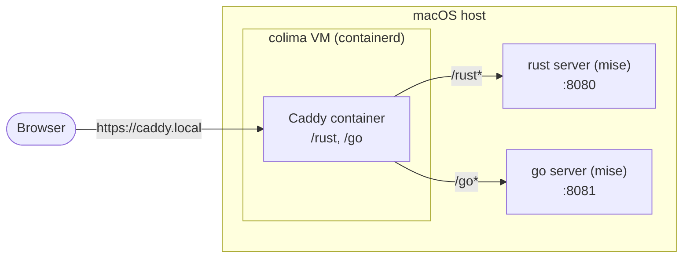

# dev-poc

POC for a declarative dev environment based on [mise](https://mise.jdx.dev) and [colima](https://github.com/abiosoft/colima).

## Purpose

The aim is to give a dev/team a fully declarative local environment: everything needed to get running lives in `mise.toml` and a couple of config files, instead of scattered docs, onboarding shell scripts, or a wiki page full of `curl`/`brew install` commands. Clone the repo, run one command, get a working environment.

Mise and colima are used for different halves of that environment:

- **mise** manages language runtimes and their versions — rust, go, node, etc. Anything you'd normally reach for `nvm`/`rustup`/`gvm` for.
- **colima** manages services that belong in a container — Caddy, Postgres, or anything else that isn't a language runtime for the project itself.

This repo demonstrates the pattern with two toy servers (Rust and Go) run via mise on the host, and Caddy run via colima/containerd as a reverse proxy in front of both — so they're reachable under the same domain (`caddy.local/rust`, `caddy.local/go`) instead of separate ports.

## Architecture



mise runs the rust/go servers directly on the host. colima's VM runs Caddy as a container, reaching back out to the host (via `host.lima.internal`) to reverse-proxy `/rust` and `/go` to the two servers.

## Getting started

Requirements: [mise](https://mise.jdx.dev/getting-started.html) and [colima](https://github.com/abiosoft/colima#installation).

1. Install the pinned tools (rust, go, colima, watchexec):

   ```sh
   mise install
   ```

2. Start colima and bring up the containers (Caddy):

   ```sh
   mise run bootstrap
   ```

3. Run the toy servers, each restarting on file changes:

   ```sh
   mise run rust:dev   # rust server on :8080
   mise run go:dev      # go server on :8081
   ```

4. Add `caddy.local` to `/etc/hosts`, pointing at the colima VM's address (from `colima status --profile hello-rust`):

   ```
   192.168.64.x  caddy.local
   ```

   Then browse `https://caddy.local/rust` and `https://caddy.local/go`.

## Tasks

Run `mise tasks` for the full list. Common ones:

- `mise run bootstrap` — start colima and bring up the containers (Caddy)
- `mise run rust:dev` / `mise run go:dev` — run a server, restarting on file changes
